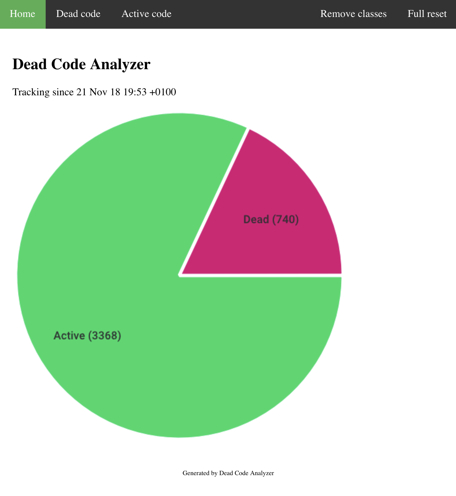

# Dead Code Analyzer

Finds dead code in PHP projects by hooking into the autoloader.

## Installation

1. [Start Go server](server/README.md)
2. Make sure to add all FQCN classes to the server
3. Run `composer require ruudk/dead-code-analyzer`
4. Add [.dca.config.php](.dca.config.php) to your project root (where vendor directory is located)
5. Deploy and wait for results 
